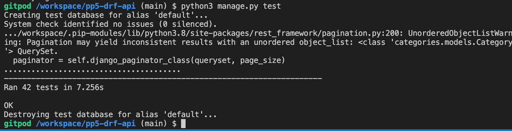

# Social Media Backend API

In this API, my goal was to implement the functionality to handle all the necessary data needed to create a fully functional social media platform. The API has full CRUD(create,read,update and delete) functionality which lets registered users upload their own posts with the optional ability to include a title, caption and category. You can edit or delete posts as long as you are the owner of them which is ensured with the addition of authorisation in this project. In addition, signed in users can pin posts they would like to add to their boards, while also having the ability to comment on posts and liking other users comments.

Users can follow other profiles and you have the ability to customise your own by changing your profile picture, your location and adding a bio. When creating posts, you can optionally assign it to a category. If you do so, I plan to implement the functionality of searching for a specific category and having all posts associated with it displaying on the front end. Categories can also be added to posts later in time since that field is present and can be updated when editing a post.

## API Features

### Drf_Api app

The drf_api is my initial project app that contains the settings.py, my main urls.py and my permsissions.py files. To allow my api to use Cloudinary for its image file storage, the settings.py file contains all the relevant code to acheive this. Also in my settings.py is all code relating to the implementation of jwt refresh tokens, corsheaders and the list of all of my installed apps. The code to achieve most of this functionality was taken from the drf_api walkthrough project.

In my views.py file, there is a custom logout view that I have included to address a known logout error with dj-rest-auth that prevents users from logging out correctly. This code was also taken from the drf_api walkthrough as it was a suggestion to fix this error.

### Permissions 

My project requires different levels of permissions depending on what it is that the user is trying to accomplish. In my permissions.py file, I have defined two custom permissions and there is a default rest framework permission declared in my settings.py file. The default project wide permission I am using is IsAuthenticatedOrReadOnly. This allows anybody to read all parts of my api but you have to be an authenticated user to have the ability to create, update or delete any data.

My first custom permission is IsOwnerOrReadOnly. I have applied this to my DetailViews only. The permission checks the current user against the owner of the data trying to be accessed, and only lets you make changes to that data if you are the owner of it. This will prevent users editing or deleting other users posts/profiles and more.

The second custom permission I have created is IsAdminOrReadOnly. This permission has been used primarily to handle the creation and deletion of categories. I only want an admin user to have the ability to create categories as having that universally available will quickly result in an overabundance of them. As well as creating them, only an admin user can edit or delete them. Every user will be able to retrieve the list view of categories but the form to create new ones and the button to delete them will not be present unless the signed in user is an admin.

### Posts App

This app contains my post model and all of the associated files to ensure that the api has full CRUD functionality. My model contains all of the expected fields that are present on a modern day social media platform. Users can upload an image along with the post title, a caption and also assign the post into a category if they wish.

In the serializers.py file, there are a number of extra serializer method and read only fields that I have added. These include the is_owner and pinned_id fields along with the num_of_pins and num_of_comments fields. The num_of fields have been added from the views.py which used django Count to work out how many pins and comments each post has and then assined the num_of fields an integer value. Also present in my serializers file is a validation method, validate_post_image. This method ensures any images posted by users meets certain criteria. The method checks that the height and width does not exceed 4096px and that the overall file size is not bigger than 2mb. If any images do not meet this, then a validation error is raised and an appropriate error message is shown to the user without crashing the api. The validation is important for numerous reasons. Firstly, it makes image processing easier for the server to handle while also keeping network latency down and it also ensures that images will display properly on different screen sizes.

Like all of my views in this project, there are 2 that users can access. The first is a ListCreateApiView which displays all posts in this instance and and the second one being a RetrieveUpdateDestroyApiView where the user can request a specific one by adding a post's primary key to the end of the url. If you are authenticated, a form will appear at the bottom of the list view, letting users create a post. On the detail view, the post retrieved along with the post details will appear on a form at the bottom of the page also along with a delete button, but only if you are the owner of the post. On the queryset field is where I have used Count to tally up the total number of pins and comments which are added on the serializers file. I have used django-filters on the PostListView to allow users the ability to filter posts by owner, category, posts from users the selected user is following and posts that the selected user has pinned. You can also order posts according to the number of pins or the number of comments that they have as well as searching for a specific post using either the title or a username as search fields. The only permissions class i'v had to specify here is the IsOwnerOrReadOnly permission on the PostDetailView as the list view automatically uses IsAuthenticatedOrReadOnly as declared in the settings.py file. As outined above, this just ensures only the owner of a post can edit or delete it.

### Profiles App

My profiles app stores all data regarding all of the users profile information. Some of the fields present in my model include name, location, bio and an optional profile image. Like on the post model, if you choose not to upload your own image then a default profile image will be set for you. Also present in my Profile model is a create_profile function. What this function does is use django signals to see when a new User instance is created. When this happens, a new profile instance is automatically created as well so it is then associated with that user instance.

Within my serializers.py file, there are several extra Serializer and ReadOnly fields added. Three of these include num_of_posts/followers and following. These fields use the Count method in my views.py to add up the totals which can then be used on the frontend to display statistics to different users. Similar to my post serializer, there is also image validation present here to ensure profile_images meet the required dimensions and file size.

As profiles are created automatically using the create_profile function described above, my ProfileList is just a standard ListAPIView. I have added multiple ways to explore profiles here which include DjangoFilterBackend, searchFilter and orderingFilter. Profiles can be searched based upon usernames, profile names and even location. The filterset fields included here are as shown in the drf_api walkthrough. These were to show profiles that are following a selected user and profiles that are followed by the selected user. Lastly, my ProfileDetail view here is a retrieveUpdateDestroy and as usual the permission class only allows the profile user access to these functionalities.

### Followers App

This app contains all instances of a user that is following or is followed by another user. Fields present in the model include the user who is the follower, the user doing the following and the timestamp of when the follow was received. There are 2 foreign key fields here linking to User, therfore they use the related_name attribute to make sure django can tell them apart. Also in my Follower model is another function, which will raise an integrity error if a user attempts to follow his/her own profile.

My serializers.py contains a couple of extra readOnly fields just specifying the owner and the user who received the follow. The create function is present so users can succesfully create a follow and details of the Integrity error raised from self following is also present here. My views are very simple and contain minimal information also. The list view allows users to list and create followers and if you are the owner of a follow this can then be deleted in the FollowerDetail view.

### Pins App

Pin is the first of my own custom models, and it holds all data of when a user pins a post. M Pin model has two foreign keys, one to User and the other to Post. These are necessary to ensure the model can determine the user that is performing the pin and the post that they are perfoming it to. I have let users have the ability to pin their own posts as well as others. This is because pinned posts will be added to the current users board, and therefore users may wish to have their own posts displaying there too. I have included a unique together field which contains owner and post on my model also. This is present to stop users from pinning a post more than once, and an error will be raised if they attempt to do so.

My serializers file simply contains the fields from my models and the extra readOnly field, post_title. This just gets the title of the pinned post, to provide extra information to the user. The create function is here again, and raises a validation error with an appropriate error message if an attempt is made to pin a post more than once.

My PinListView is a ListCreateAPIView so it displays a form on the page to pin a post as long as you are logged in and authenticated. The pins can be filtered through by post title or the owner of the pins using DjangoFilterBackend. In my detail view, it is a retrieveDestroyAPIView as pins cannot be edited. If you are the owner of the pin, you can use the delete button on this page to remove them from the database.

### Comments App

The comments app stores all data relating to any comments left on a post. It stores data on the post, user, timestamp and the text commented. My model has two foreign key fields, one to User and one to Post. 

In my CommentSerializer, I have added some extra fields to give users more detail on the comment and user who left it. I have imported and used naturaltime to display the timestamps more appropriately for a comment for example, 1 day, 4 hrs ago. Num_of_comment_likes is another field that I have included here. This relates to my comment_likes app which is used for liking different user comments. This field will use the Count method on my views.py to display how many likes a specific comment has. A second commentDetailSerializer class has also been implemented here. It adds the post_id via a readOnly field and it is used in my CommentDetailView. The reason for this is that it will auto-fill the post of the comment a user is trying to edit. This will save the user time trying to find the post relating to the comment and therfore provides a better user experience overall. This piece of code is accredited to the drf_api walkthrough project.

In my views.py file, the list view is a ListCreateAPIView as normal and includes the annotate method which is used to calculate the num_of_comment_likes and display the results to the user. Comments can be filtered by owner and post, while ordering fields are also available to display comments in the order of creation via their timestamp. The detail view is a retrieveUpdateDestroy view and the only difference here is that the serializer class is set to CommentDetailSerializer as opposed to CommentSerializer so the post is auto-selected.

### Comment_likes App

This model stores all the data on comment likes. Similar to alot of my other models, it has two foreign key fields. One being User and the other Comment in this instance. There is a unique_together field between owner and comment, which is present to ensure a comment can only be liked by a specific user one time. 

The only extra field present in my serializer is comment_text which as the name suggests, shows the actual comment to the user. Also present in my serializer is the create function. As usual, it has a try/exceot block which attempts to create the like. If the user has already liked the comment then a validation error is raised along with an error message explaining the problem.

On my views.py file, my commentLikeListView is a listCreateAPIView. If signed in and authenticated, you can use the form at the bottom of the page to select a comment from the dropown list and press confirm to like it. I have used DjangFilterBackend which lets users filter the comment likes by a certain comment. Lastly, the detail view retrieves a specified like and if you are the owner of it, then it can be deleted from this page.

### Categories App

The Category model stores the names of a category that can be assigned to a post on the creation of it. Within the Post model, there is a category field present which is a foreignKey value linking to this model. The idea of this, is that the user will have access to a dropdown list of categories on the form in the frot-end that they can choose from and assign their post to. As well as assigning a category when creating a post, users can assign or change them when editing one of their posts also. 

In my CategorySerializer, the fields present in my model are listed here as well as one extra which adds up all the posts assigned to a specific category. In my views.py file here, I have assigned both the listView and the detailView the permission class of IsAdminOrReadOnly. This is because I want only an admin to have the ability to create new categories or delete exisiting ones. Search and ordering have been included here so users searching for a single category can be found or categories can be ordered based on their timestamp of creation.

### Admin Panel

One of the first steps taken in this project was to create my superuser and ensure that functionality was running as expected. Throughout the development process, I registered all of my apps in admin.py to ensure I can access these features there and test the functionality from the admin panel if necessary. This also made testing easier once I had deployed the application as it is difficult to test from the api deployed site unless its done through the admin panel.
Full CRUD functionality works as expected and any registered administrators can monitor all goings on from here.

The login for the superuser account is as follows - 

***Username - admin***\
***Password - esporta1993***

## Future Features To Implement

- I would like to include a new app for comment_replies. I feel this would work well alongside the comment_likes that I have already included in this project.

- Signing in with social media is a feature I planned to include in the planning stages of this project. Unfortunately, I did not have the time to implement this before my submission date.

## Languages/Libraries Used

Below is a list of the requirements that were included to make this project

- Django
- Django Rest Framework
- Cloudinary
- Pillow
- Django allauth 
- Django filters
- Psycopg2 database
- SimpleJWT

The primary language used in the production of this api was Django and the django-rest-framework. Pillow is a library that is a required depenedency you have to install when using an imageField on any of your models. I used Cloudinary for my default image storage. This is because Django uses an ephemeral file system, so Cloudinary was a  great choice to prevent my image files being deleted after a certain amount of time has passed. Django filters was a library used to add the functionality to filter the data in my views.py files. It makes it extremly easy to add this functionality and improves the user experience considerably. To add token refreshing to my project, I used simpleJWT as shown in the drf_api walkthrough.

## Deployment 

### Local Deployment

The points below outline the steps taken to deploy my project to a local server

- Create a new GitHub repository
- Select the code-institute-full-template and type in a name for the repository 
- Click on the green Gitpod button to open a new Gitpod workspace
- Download any required dependencies such as Django, Django-Rest-Framework, Pyscogpg2 etc
- Create a requirements.txt file using the command pip3 freeze --local > requirements.txt
- Create a new Django project using the command django-admin startproject "project-name-here" 
- Create a new Django app using the command python3 manage.py startapp "app-name-here"
- Add the above app name to the list of installed apps in your settings.py file
- Migrate the changes to your database using the command python3 manage.py migrate
- Run the project using the command python3 manage.py runserver
- The project should now be up and running on port 8000

### Live Deployment 

The points below document the steps taken to connect to the ElephantSQL database and then deploy my live project using Heroku

- On GitHub, fork your repository so it is not deleted after inactivity
- The database used in production is only accessible within Gitpod, so you first need to create a new database
- Navigate to ElephantSQL.com and navigate to your dashboard or create an account if you do not have one
- Click on the link "Create New Instance"
- Fill in the details required - Your name, select the tiny turtle(free plan) and leave the tags field blank.
- Select the region thats most relevant to you
- Click "review", ensure all of the information you have given is correct and then select "Create Instance"
- Return to your dashboard and navigate to the database instance name for the project
- Next you will need to copy the database URL that is present, as you will need that for Heroku
- Navigate to heroku.com and go to your dashboard or create an account if you haven't already 
- Click on "New" and then "Create new app"
- select the region that applies to you, give the app a unique name and press create app
- Navigate to the settings tab, and open the config vars
- Add a config var named "DATABASE_URL" and paste in the value that you copied from ElephantSQL
- Use the below command to install the necessary items to connect to your external database
 pip3 install dj_database_url==0.5.0 psycopg2
- In your settings.py file import dj_database_url
- Navigate down to the databases section and update it with the below code
  if 'DEV' in os.environ:
     DATABASES = {
         'default': {
             'ENGINE': 'django.db.backends.sqlite3',
             'NAME': BASE_DIR / 'db.sqlite3',
         }
     }
 else:
     DATABASES = {
         'default': dj_database_url.parse(os.environ.get("DATABASE_URL"))
     }
- Next, go to your env.py file and add a new environment variable as shown below
os.environ.setdefault("DATABASE_URL", "your PostgreSQL URL here")
- Temporarily comment out the below code so Gitpod can connect to the new database
os.environ['DEV'] = '1'
- The next step is to use the below code to migrate your changes to the database
 python3 manage.py migrate
- In the terminal of gitpod, install gunicorn and update your requirements.txt file using the two below commands
 pip3 install gunicorn django-cors-headers
  pip freeze --local > requirements.txt
-  You now need to create a Procfile and add the below code to it 
release: python manage.py makemigrations && python manage.py migrate
 web: gunicorn "your project name here".wsgi
- Next you need to update the value of ALLOWED_HOSTS in your settings.py file to the below code 
 ALLOWED_HOSTS = ["localhost", "your_app_name>.herokuapp.com"]
- Add "corsheaders" to your list of INSTALLED_APPS in settings.py
- Add corsheaders middleware to the top of the MIDDLEWARE as shown below
MIDDLEWARE = [
     'corsheaders.middleware.CorsMiddleware',
- Under the middleware list, set the ALLOWED_ORIGINS for the network requests made to the server with the below code
if 'CLIENT_ORIGIN' in os.environ:
     CORS_ALLOWED_ORIGINS = [
         os.environ.get('CLIENT_ORIGIN')
     ]
 else:
     CORS_ALLOWED_ORIGIN_REGEXES = [
         r"^https://.*\.gitpod\.io$",
     ]
- Remove the value for the secret key and replace it with the below code instead
SECRET_KEY = os.getenv('SECRET_KEY')
- Now set a new value for your secret key in the env.py file as outlined below
os.environ.setdefault("SECRET_KEY", "CreateANEWRandomValueHere")
- Set the debug value to the below code to ensure its only true in development mode
 DEBUG = 'DEV' in os.environ
- Comment in the DEV variable in the env.py file that we commented out earlier
- Lastly, commit and push your changes to github
- Back on the Heroku dashboard, we need to add two final config vars
- Add a SECRET_KEY and a value of your choice 
- Copy and paste the CLOUDINARY_URL from cloudinary.com and add that value to your config vars also 
- Navigate to the deploy tab on Heroku
- Connect to your GitHub account and type your repository name 
- Click deploy and your project should now be live

The link to my live api can be accessed here -
https://social-media-drf-api.herokuapp.com/

## Testing 

### Manual Testing 

Extensive testing has been carried out throughout production in the development server and also on the deployed live site to ensure the functionality still works as expected. 

Testing that I have carried out in the development server includes - 

- I have created numerous user accounts and ensured a profile instance has also been created and linked to the appropriate user
- One user cannot create more than one profile and if they try, an appropriate error message is displayed to them.
- I have uploaded many posts in the testing stage and checked to make sure the correct data is saved to the database.
- Only signed in users can create posts and the edit form only shows up if you own the post. 
- The delete button only shows up in my detailViews if you are the owner of the data. 
- Authenticated users can create pins and they function as expected. You can only delete the pin if you are the wner of it.
- Any edits that are made to data is saved, and it then displays with the updated data showing.
- Authenticated users can comment on posts. The comments save as expected and show the correct data. post_title, text etc
- The same user can leave multiple comments on one post but if attempts are made to pin a post or like a comment more than once, then an appropriate error message is displayed.
- As an unauthenticated user you can read all the data that is in the api, but you are unable to create any data yourself and no forms for this functionality show up on any of the pages.
- My IsAdminOrReadOnly permission functions as expected. If anybody other than an admin is on the category list/detail views, it is only a read only file and no data can be created or deleted.
- All of the filters that have been implemented work as expected. If I have tested these out multiple times and checked for any problems, but the expected data is always provided.
- All of my urls lead to the correct pages on the api. No 404 errors are displayed and all the routes function correctly.
- All of my python code passes through the validator with no issues

Once I deployed my api to Heroku, I carried out the same testing as outlined above in the development server and all of the functionality still works the same as it did before the deployment. As I can not perform CRUD operations on the deployed live api site, I got around this by navigating to the admin panel and testing all of the CRUD functionality from there. 

### Automatic Testing 

As well as the extensive manual testing carried out, I have included automatic testing in this project. Every app within the workspace has automatic tests, checking numerous functionality including CRUD behaviour, permissions, the creation of users and more. There is a total of 42 tests in total and they are all passing as expected.

## Bugs 

### Fixed Bugs

- Date/time format not showing up as expected for my profile views. I was attempting to use naturaltime to display the updated_at field in my profiles model but I kept on getting an error. After some time, I discovered that I used a date method rather than datetime method in my model. Once I saw this, I realised I could use naturaldate instead of naturaltime and this then displayed how I wanted it to.

- Logout functionality not working as expected. I saw that dj-rest-auth has a bug that prevents users from being able to logout successfully. This had affected me previously when I was attempting to complete the walkthrough project moments. To fix this bug, I had to create a new custom logout view in drf_api/views.py and manually code in the response. This code was taken from Code Institute and after implementing that, the logout functionality worked as expected.

- Deployment failed when attempting to deploy the project to Heroku. In the build logs, I was getting an error saying that I had to specify the node engine in my package.json-file. After some research, I discovered I had to insert the following code - "engines": {
    "node": "16.18.0"
},
Once I did this, the deployment worked as expected.

### Unfixed Bugs

As far as I have found, there are no remaining bugs present in this project. If this changes, they will be documented here.

## Credits

- Code Institutes walkthrough project drf_api helped me alot in the implementation of several features in this project. As django-rest-framework was totally new to me, this walkthrough really helped me get to grips with the framework and understand some of the features that were new to me.

- Code Institute slack group. The community here was a great resource during this project, particularly the project 5 Advanced-Frontend group. There was plenty of interaction and most problems could be figured out through the use of this channel.

- I used stack-overflow to research more about django-filters and this helped me to understand the features of that much better.